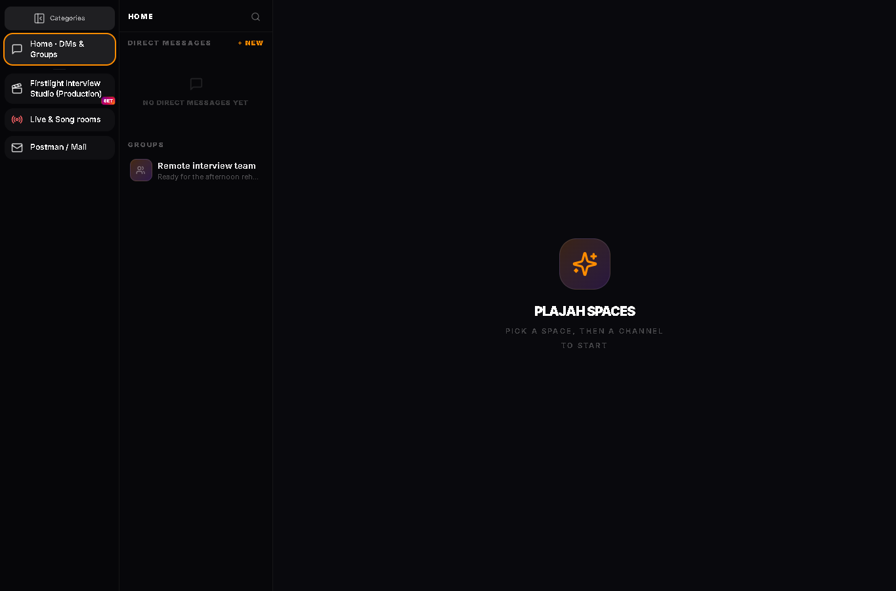
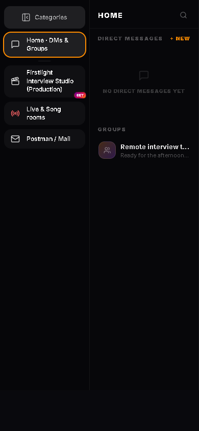

# Chat and live production assessment

Updated October 7, 2026. This is an implementation checkpoint, not a claim of WhatsApp, Telegram, Zoom, or Teams parity.

## Implemented in this change

| Area | Behavior |
| --- | --- |
| Chat navigation | The category rail expands with an explicit, accessible button, shows production and organization names, and remembers its width preference. The conversation column can shrink on phones. |
| Room previews | Encrypted room previews decode on the client rather than showing `enc:` payloads. Encrypted notification previews use a readable generic label. |
| Backgrounds | Every ordinary conversation has personal gradients or a photo, scoped to the signed-in user and room on this device. Photos are metadata-stripped and stored locally. Existing intimate themes remain supported. |
| Collaboration entry | The Spaces shell now opens collaboration boards instead of invoking an empty handler. |
| Tela collaboration | Existing board strokes convert non-destructively into a native Tela board. Users edit with the actual Tela editor and share document checkpoints. Revision transactions reject stale overwrites and preserve a conflict copy locally. |
| Tela in chat | Native document snapshots preserve devices, frames, and bindings. They use the existing room encryption, render inside chat, and can be opened as independent editable copies. Inline snapshots are capped at 600 KB before encryption. |
| Call controls | Raise/lower hand travels over the shared RTC data channel and is shown to other participants. Existing screen sharing, device switching, recording, reactions, and invitation controls remain in place. |
| Meeting governance | Hosts appoint moderators, assign conversation members to named breakout rooms, request microphone mute, remove/restore attendees, and return everyone to main. Transactional revisions reject stale writes. |
| Meeting isolation | Each main/breakout room has its own RTC namespace and encrypted message stream. Backend rules restrict access to assigned conversation members, reject sender/presence spoofing, and block cross-room signaling. Removed or reassigned peers are disconnected, immediately filtered from production, and cannot reconnect through stale presence. |
| Call production | A room owner can publish a consent-filtered group canvas and isolated guest feeds. Conversation owners, meeting hosts, and both legacy and governed moderators are excluded from video and audio. Consent defaults off. Role and room assignments are watched while a call stays open. |
| Ambo handoff | The producer can send the current group shot and eligible single shots as native LIVE slides. A per-user session queue delivers them when Ambo opens and adds them to its library and playlist. |
| Switcher discovery | Call production feeds appear automatically as switcher sources. Revocation removes feeds from the catalog and invalidates Ambo inputs. Borrowed streams are detached without stopping the originating call. |
| Audio lifecycle | Repeated stream updates do not duplicate audio connections. Single shots start muted so they do not duplicate the group mix. Mute/unmute restores the fader value instead of an instantaneous meter level. |
| CG | A dedicated Tela/Ambo CG panel uses Ambo templates, its motion renderer, and Tela editing. Graphics composite directly from a canvas so transparent artwork retains alpha. |
| Color | The former success-only LUT upload now parses and applies a real 3D `.cube` LUT through the same GPU compositor used by Fabula. |
| Hardware | One validated production command layer drives preview, take, cut, auto, and source gain. Stream Deck can use its built-in Hotkey action. A Web MIDI surface can select inputs and control faders. |

## Existing foundation and limits

`rtcCore` and `useRtcSession` already underpin messaging calls, World Cup fan video rooms, podcast call-in, mobile streaming, and stream viewing. This is the transport foundation to retain. It is not yet a complete shared meeting product layer for Academia, Elevate, and all fan-room experiences.

The current mesh topology creates peer connections between participants. It needs an SFU-backed topology, bandwidth adaptation, admission controls, and real device/network soak tests before large meetings can be described as reliable.

The current chat encryption derives keys from the room ID and a constant bundled salt. It is **not end-to-end encryption against the platform operator**. Native Tela snapshots use that same existing mechanism. WhatsApp-style confidentiality needs an authenticated device-key protocol, rotation, multi-device identity, recovery, and a separate security review; changing the legacy key would strand existing messages.

Tela's canonical document bodies are locally stored. Shared collaboration checkpoints carry the document to other devices through the existing collaboration project record. They are not concurrent operation merging or live multiplayer cursors. A shared operation log with conflict resolution and document/asset authorization is still required for simultaneous editing.

The production catalog and live MediaStreams are local to the running JavaScript environment. The Ambo handoff targets a presenter in that environment, including one opened after the handoff in the same session. Keep the originating call running for live media. Cross-window/device routing, unattended output reconnection, and independently running native hosts need a transport bridge. Ending a feed clears it; no frozen last frame is deliberately retained.

The talking-head compositor currently uses a centered adaptive grid. Matching group/single variants for every existing Ambo visual family remains separate work. The conversation owner, meeting host, and appointed moderators are excluded from production audio/video. Production consent resets when moving between meeting rooms and departing peers lose cached consent.

The shared meeting service currently provides one persistent meeting space per conversation, with separate main and breakout threads. Room changes re-establish media connections rather than providing a seamless SFU handoff. Microphone moderation is a request handled by the client; attendees may unmute themselves. Recording stops and saves when switching rooms or leaving. Captures arriving after cancellation are released without publishing stale presence. Persistent meeting instances with their own lifetimes, waiting rooms, announcements, and classroom/fan-room migration remain pending.

**Release dependency:** deploy the matching `firestore.rules` before releasing the new call namespace. This checkpoint does not deploy rules or application code. Calls fail closed if the new namespace is not authorized. Existing broad `rtc_sessions` permissions still serve the other legacy live surfaces; the chat meeting path no longer uses that namespace. Parent room updates now prevent ordinary members from taking ownership or changing legacy moderator roles.

## Remaining delivery work

1. Extend the new shared meeting domain layer with persistent meeting instances, waiting rooms, announcements, independent lifetimes/retention, and meeting scheduling. Migrate Academia, Elevate, and fan rooms onto the governed meeting service and its restricted transport namespace.
2. Add SFU transport with TURN verification, reconnect behavior, network/device adaptation, audio priorities, screen-share attribution, and tests across Android, desktop, slow networks, and large rooms.
3. Move collaboration from checkpoints to a shared Tela operation log. Preserve legacy boards, reject unauthorized operations, synchronize assets, and make offline edits mergeable.
4. Extend production discovery to authorized user/organization live streams, remote media assets, Tela documents, and native/cross-device outputs. Add durable routing and operator-visible source health.
5. Produce family-matched group and solo templates, camera-safe crop controls, participant naming, and operator source selection. Preserve moderator and consent filters before every output, including recordings and remote transport.
6. Unify the switcher audio runtime with the platform/Melos engine, including mix-minus, monitored versus program buses, limiter behavior, latency compensation, and per-output routing. This change fixes source lifecycle and faders; it does not replace the entire mixer.
7. Extend the shared GPU processing path beyond LUTs to live segmentation, matting, tracking, lenses, and consistent VTuber controls. VTuber hooks already exist in the switcher engine, but the complete effect suite and its device capability reporting are not newly implemented here.
8. Implement and validate a native ATEM adapter, Stream Deck SDK plugin with tally/state feedback, connection/pairing UI, profile persistence, and physical-device tests.
9. Complete mobile SMS/MMS as a separate opt-in default-handler feature. Carrier RCS requires vendor/carrier arrangements described below.

## Android SMS and RCS

SMS/MMS is technically possible. For the usual Google Play distribution path, Plajah must qualify as the user's default SMS handler, request the role before restricted permissions, provide the required messaging functions, and stop accessing SMS when the role is lost. This is primarily Android/Play permission policy, not a blanket regulatory prohibition. Carrier behavior and regional requirements still need validation for the actual release.

Android's RCS IMS single-registration APIs require a privileged, preinstalled messaging app, default SMS role, and carrier certification. A regular third-party Play Store install cannot use that path merely because the user opts in. Do not label Plajah's internet chat as carrier RCS, or treat RCS Business Messaging as access to a consumer's personal RCS inbox.

Sources: [Google Play SMS permissions policy](https://support.google.com/googleplay/android-developer/answer/10208820?hl=en), [AOSP IMS single registration](https://source.android.com/docs/core/connect/ims-single-registration).

## Hardware integration

Elgato provides a public Stream Deck plugin SDK. It communicates with the Stream Deck application over a dedicated WebSocket and supports software actions. A plugin can eventually use Plajah's shared command layer and display tally, recording state, source labels, and connection errors. The current implementation uses the device's built-in Hotkey action and requires the Plajah switcher to be focused with hardware hotkeys enabled.

Current hotkeys: Ctrl+Alt+1–9 selects preview; adding Shift takes that input. Ctrl+Alt+Enter cuts; adding Shift runs auto transition. Repeated keydown events and typing into form fields do not trigger switching.

Current MIDI mapping: notes 36–44 select preview inputs 1–9; note 45 cuts; note 46 runs auto. CC 0–8 controls source faders. Inputs are numbered in the visible switcher source order, including Black and Bars. Web MIDI requires a supporting browser/host and an explicit permission grant.

Blackmagic provides a public ATEM Switchers SDK for controlling ATEM switchers and observing their state. It is a vendor SDK, not a generic browser HID API or a guarantee that every ATEM panel can be independently repurposed. A native adapter can control the physical ATEM from Plajah and map approved ATEM state changes to software actions. Bidirectional mappings must suppress feedback loops and be validated for the selected switcher/panel model. The native adapter is **not implemented** in this checkpoint.

Sources: [Stream Deck SDK](https://docs.elgato.com/streamdeck/sdk/references/websocket/plugin/), [Blackmagic ATEM SDK](https://www.blackmagicdesign.com/developer/products/atem/sdk-and-software), [ATEM SDK manual](https://documents.blackmagicdesign.com/DeveloperManuals/ATEMSDKManual.pdf).

## Verification

The full Vite production build completed during implementation. Later handoff-queue and snapshot privacy adjustments passed focused tests and syntax checks; the full bundle has not been rebuilt after those final adjustments. Existing project warnings include large bundles, mixed static/dynamic imports, and browser-externalized dependencies. The build output was isolated from the existing application/native assets.

All 43 tests in the selected suite pass. They cover moderator exclusion, consent defaults, grid geometry, feed revocation, preservation of original call tracks, call-mute propagation, duplicate audio connection prevention, hardware command validation, legacy board migration, queued Ambo handoffs, breakout assignments, role boundaries, and RTC cancellation/removal lifecycles. Existing Ambo round-trip/source discovery and production chat/artifact tests also pass.

Run: `node node_modules/tsx/dist/cli.mjs --test tests/rtcMeetingLifecycle.test.ts tests/meetingCore.test.ts tests/amboLiveCallShows.test.ts tests/chatProductionCore.test.ts tests/chatProductionLifecycle.test.ts tests/amboTelaSlideRoundTrip.test.ts tests/amboSourceDiscovery.test.ts tests/productionChat.test.ts tests/productionChatArtifacts.test.ts`.

The read-only Firebase Rules evaluator passed 35/35 tests against the extracted meeting rules and parent ownership update boundary. All parent/control document reads are mocked; no rules or application data are written. Parent schema/production helpers are stubbed solely for ownership-boundary tests. This does not replace emulator or multi-device end-to-end validation. Run `node scripts/testMeetingRules.mjs` with an existing Firebase CLI login. [Firebase Rules testing reference](https://firebase.google.com/docs/reference/rules/rest/v1/projects/test).

This second meeting checkpoint has not had a full production rebundle or authenticated browser/device meeting test. The scoped typecheck still reports 56 existing imported-subsystem errors, with none in the new meeting files or updated RTC/chat hook.

A scoped TypeScript check exposes pre-existing errors in Tela artwork/image models, publication registries, Fabula graphic types, and other imported subsystems. These remain release blockers for a clean typecheck. Passing a production bundle or unit tests does not establish meeting-scale reliability, native SMS support, or physical hardware interoperability.

The styled sidebar was checked in a local automated browser at 1365×900 and 390×844. Expansion, persisted preference, readable wrapping, and absence of mobile horizontal overflow passed without browser runtime errors.

